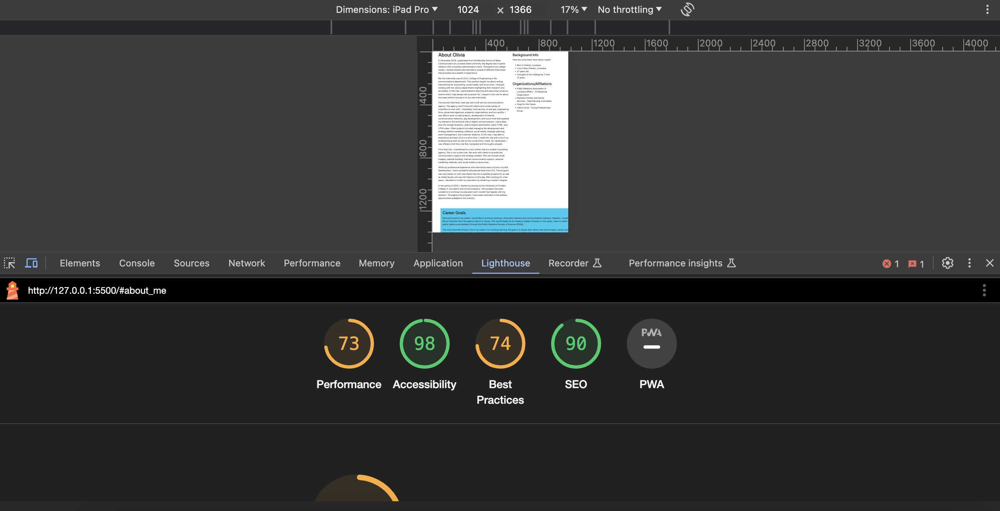

# m14-hw14-blackstock-olivia
## Stumbling Blocks 
I found using Bootstrap quite easy. The use of the grid and spacing was simple to use and set up. I used the carousel and card components from Bootstrap on my page. I felt this took me a while only because I was enjoying learning about the various components. The only complaint is that I do like a bit more CSS customization, but for the purposes of this assignment stuck with the built in CSS mainly. 

## Lighthouse Report 
